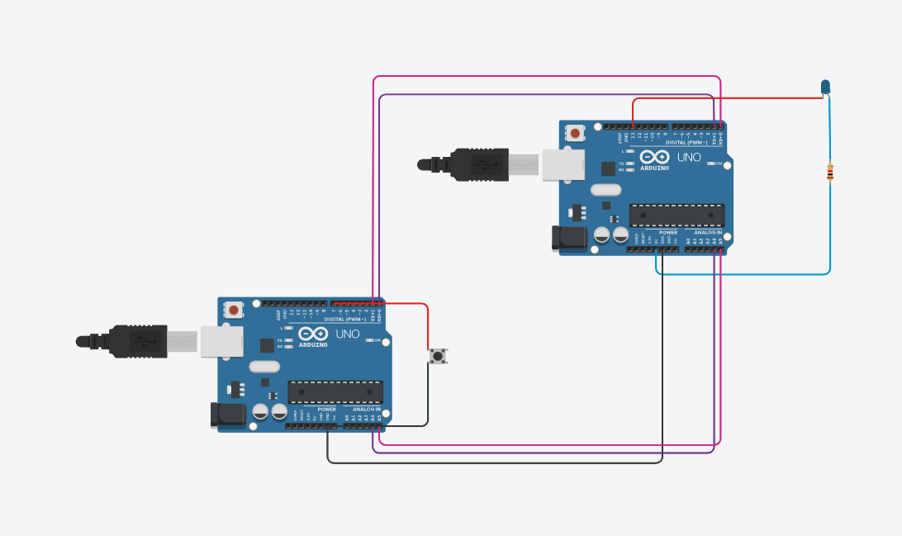
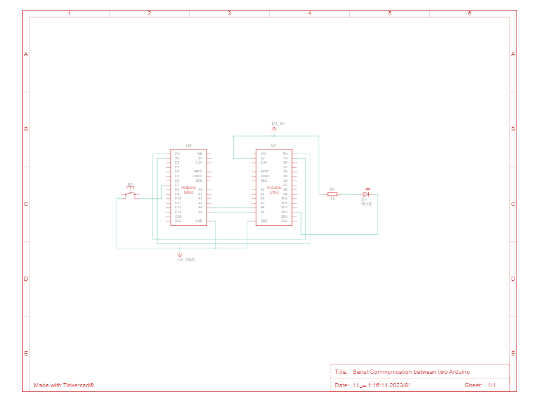

# I2C_Connected
creating a simple project using two  Arduino boards--one with a button and the other with an LED.

# WHAT IS I2C?
 
 The term "Inter-Integrated Circuit" is an abbreviation. For sending data across brief distances, low-speed serial communication protocols like I2C are utilized. This protocol is not suggested if data needs to be sent over a significant distance. Therefore, our objective is to build a straightforward project utilizing two Arduino boards, one of which has a button and the other an LED.

# Here's a step-by-step guide to achieving this:

  # Materials Needed:
   1. Two Arduino boards (e.g., Arduino Uno).
   2. wires.
   3. Push-button.
   4. LED.
   5. Resistor.
   
  # Circuit Connections: 

  

   First:
     I2C Connections:
    You can find the connection you need by utilizing this Link:
    [Link](https://www.tinkercad.com/things/dPemnou0diO-serial-communication-between-two-arduino)
    
   Second: 
     Arduino 1 (Button) Connections:
   1. Connect one leg of the button to GND.
   2. Connect the other leg of the button to a digital pin (e.g., Pin 2).

   Third: 
    Arduino 2 (LED) Connections:

   1. Connect the anode (longer leg) of the LED to a current-limiting resistor.
   2. Connect the other end of the resistor to 5V.
   3. Connect the cathode (shorter leg) of the LED to a digital pin (e.g., Pin 13).

   # Arduino Code:

   Arduino 1 (Button) Code:

   
    int botton = 7;
    bool bottonValue = LOW;
    char x;
    void setup() {
    pinMode(botton, INPUT_PULLUP);
    Serial.begin(9600);
    }
    void loop() 
    {
     bottonValue = digitalRead(botton);
     switch (bottonValue)
    {
    case HIGH:
     Serial.println("H");
    break;

    case LOW:
      Serial.println("L");
    break;

    default:
    break; 
    }

    }  
    

   Arduino 2 (LED) Code:

    int led = 13;
    char x;

    void setup() 
    {
  
     pinMode(led, OUTPUT);
     Serial.begin(9600); 
  
    }

    void loop() 
    {

     if(Serial.available()>0){
   
       x = Serial.read();

         switch (x){
         case 'L':
         digitalWrite(led, LOW);
         break;
    
         case 'H':
           digitalWrite(led, HIGH);
         break;

         default:
         break; 
        }
      }

      }

   # Schematic View: 

   

   # Simulation:
  
   You can find the Simulation via this Link:
     [Link](https://www.tinkercad.com/things/8ZdHR6qkxsI)
